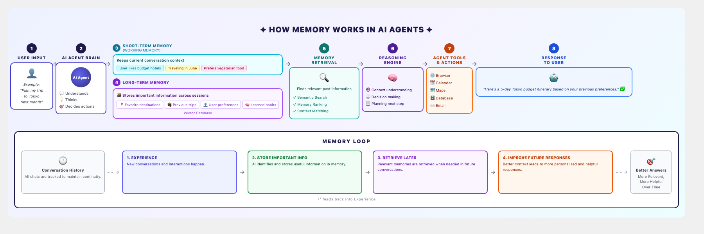

# How Memory Works in AI Agents

## Diagram

---

## Explanation of This Memory Architecture

This diagram illustrates the **cognitive memory architecture** used by modern AI agents to simulate human-like memory, enabling them to hold coherent, context-aware conversations and improve over time.

### The 8-Stage Processing Pipeline

| Stage | Name | Purpose |
|-------|------|---------|
| **1** | **User Input** | The entry point where the user submits a query, command, or request. This is the raw signal the agent must interpret. |
| **2** | **AI Agent Brain** | The core processing unit that *understands*, *thinks*, and *decides* how to handle the request. It acts as the central coordinator. |
| **3** | **Short-Term Memory (Working Memory)** | Holds the **current conversation context**—recent facts, preferences, and constraints that are relevant right now but may not need to be stored forever. Examples: "traveling in June," "prefers vegetarian food." |
| **4** | **Long-Term Memory** | Persists **important information across sessions** in a vector database. It stores structured knowledge such as favorite destinations, past trips, user preferences, and learned habits. |
| **5** | **Memory Retrieval** | When the agent needs background knowledge, it searches long-term memory using **semantic search**, **memory ranking**, and **context matching** to surface only the most relevant past data. |
| **6** | **Reasoning Engine** | Combines the current context (short-term) with retrieved memories (long-term) to perform **context understanding**, **decision making**, and **planning** of the next action. |
| **7** | **Agent Tools & Actions** | The execution layer where the agent interacts with external systems—browsers, calendars, maps, databases, email—to fulfill the request. |
| **8** | **Response to User** | The final output is synthesized and delivered back to the user, ideally personalized based on retrieved memories and reasoning. |

### The Memory Loop (Continuous Improvement Cycle)

Beneath the main pipeline sits a **feedback-driven Memory Loop** that allows the agent to learn and improve over time:

1. **Experience** — Every new conversation and interaction is tracked as an experience.
2. **Store Important Info** — The AI extracts and stores useful, salient information from that experience into long-term memory.
3. **Retrieve Later** — In future conversations, relevant memories are fetched on demand.
4. **Improve Future Responses** — Because the agent now has richer context, it produces better, more personalized, and more helpful answers.

The loop feeds back into itself: **conversation history** continuously seeds new experiences, and the outcome is **better answers over time**.

### Why This Matters

Without memory, an AI agent is **stateless**—it treats every message as an isolated event, forgetting everything immediately. With this architecture:

- **Short-term memory** gives the agent situational awareness within a single session.
- **Long-term memory** gives the agent identity, history, and the ability to recognize returning users.
- **The Memory Loop** transforms the agent from a static responder into a **learning system** that genuinely improves with every interaction.

This design mirrors how human cognition works: we hold a small amount of information in working memory, draw on a vast store of long-term knowledge, and continuously update our understanding based on new experiences.
